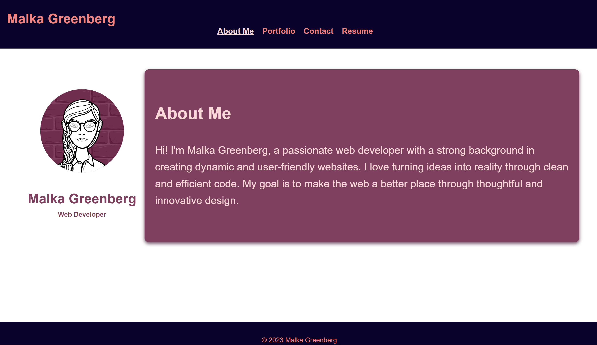

# Portfolio

## Table of Contents
- [Description](#description)
- [Features](#features)
- [Getting Started](#getting-started)
- [Technologies Used](#technologies-used)
- [Project Structure](#project-structure)
- [Usage](#usage)
- [Deployment](#deployment)
- [Contact](#contact)
- [License](#license)

## Description

This React Portfolio is a single-page application showcasing my web development projects. It is built using React and includes sections such as About Me, Portfolio, Contact, and Resume. The goal is to provide potential employers and collaborators with a comprehensive overview of my skills and projects.

## Features

- Mobile-first design
- Navigation using `react-router-dom` for seamless page transitions
- Responsive project grid in the Portfolio section
- Contact form with field validation
- Downloadable resume and proficiency list in the Resume section

## Getting Started

To run this project locally, follow these steps:

1. Clone the repository: `git clone https://github.com/your-username/react-portfolio.git`
2. Navigate to the project directory: `cd portfolio`
3. Install dependencies: `npm install`
4. Start the development server: `npm start`

## Technologies Used

- React
- React Router

## Project Structure

The project follows a modular structure:

- **src/components**: Contains reusable React components (Header, Navigation, Project, Footer).
- **src/pages**: Each section of the portfolio (About, Portfolio, Contact, Resume) is represented by a page component.
- **src/assets**: Images and other static assets.
## Usage

Customize the portfolio by replacing placeholder content in components and updating project information in the Portfolio section.

## Deployment

The application is deployed using Netlify.
View Deployed application [HERE](https://main--malka-g-portfolio.netlify.app/).

## Contact

For inquiries or feedback, feel free to reach out: 732-942-4561

## License

This project is licensed under the [MIT License](LICENSE).
